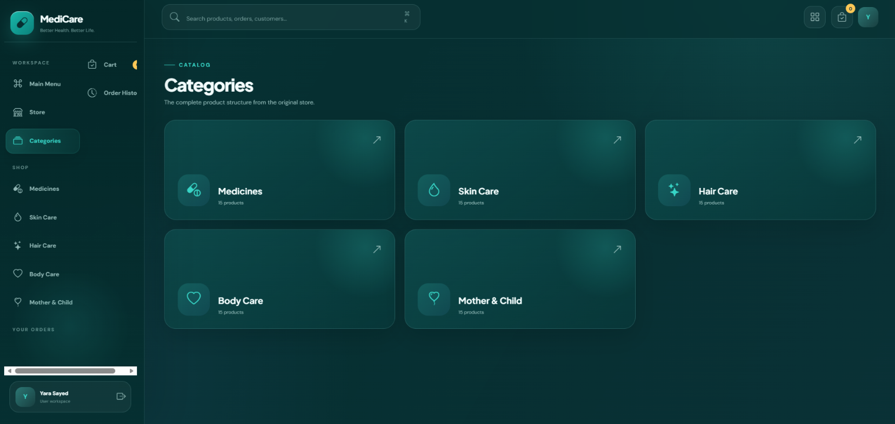
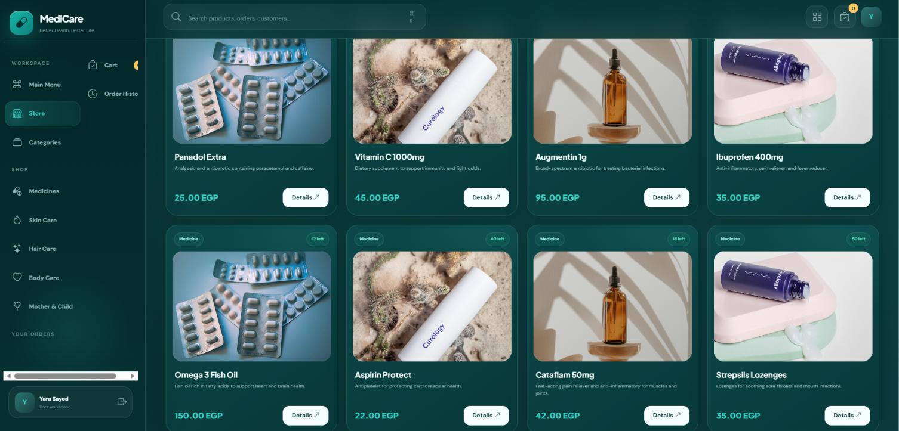
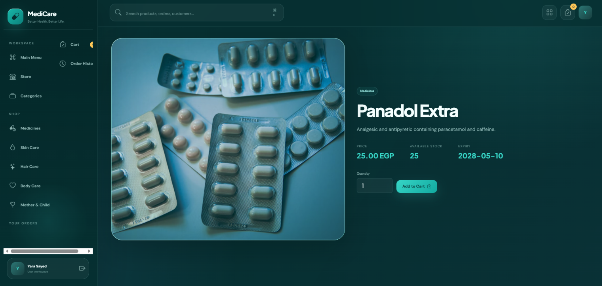
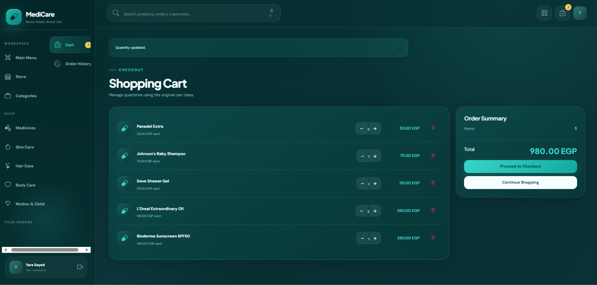
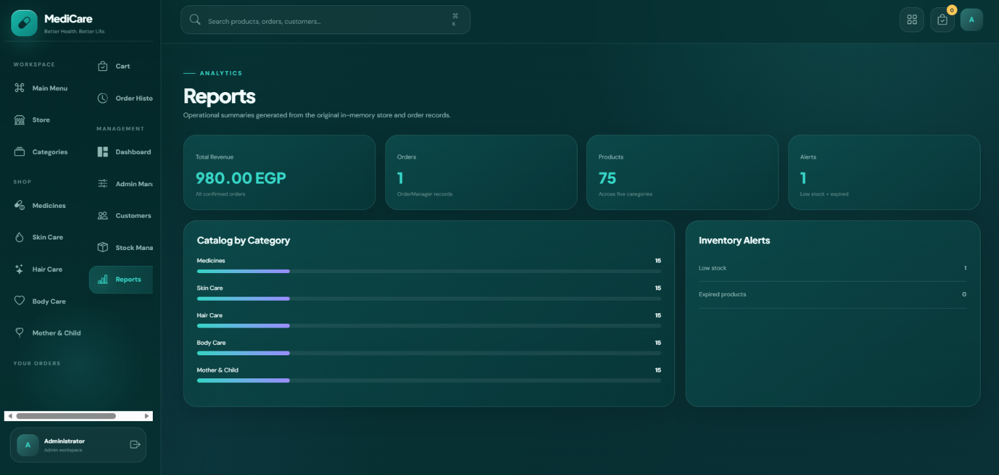

# MediCare Pharmacy Management System
A web-based Pharmacy Management System developed using Flask.

## Features
- User Login System
- Admin Dashboard
- Product Management
- Shopping Cart
- Order Management
- Order History
- Inventory & Stock Management
- Reports and Statistics

## Technologies Used
- Python
- Flask
- HTML
- CSS
- JavaScript
- JSON

## Team Members
- Yara ElSayed
  - GitHub: https://github.com/yaraaelsayed321-gif
- Esraa Mahmoud
  - GitHub: https://github.com/esraa-mahmmoud
- Asmaa Tamer
  - GitHub: https://github.com/asmaatameraboaish
- Dalia Nashaat
  - GitHub: https://github.com/dalianashaat642-svg
- Maryam Nabih
  - GitHub: https://github.com/26yn94tr2s-ops

## Project Description
MediCare is a pharmacy management system that allows customers to browse products, add items to a cart, place orders, and view order history. Administrators can manage products, monitor stock levels, track customers, and view reports through a dedicated dashboard.

## Screenshots
The following screenshots demonstrate the main features and user interfaces of the MediCare Pharmacy Management System

### Login Page

# Customer Interface
### Main Menu

### Categories

### Store

### Product Details

### Shopping Cart

### Checkout

### Order Confirmation

### Order History

# Admin Interface
### Admin Main Menu

### Admin Dashboard

### Admin Management

### Customer Management

### Stock

### Reports

